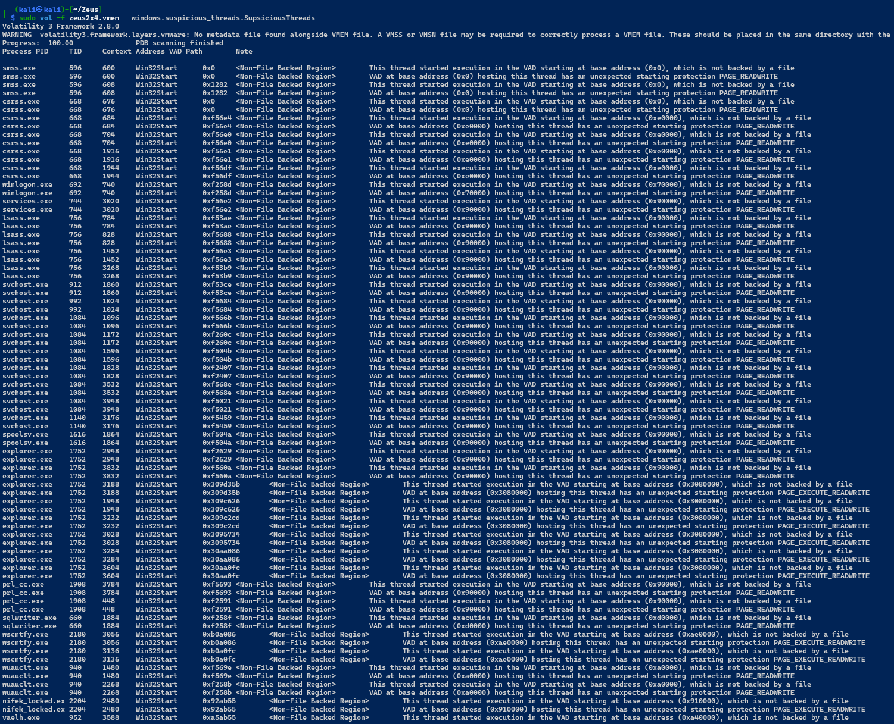

# Typhon vs Zeus
- The **Zeus trojan virus** was first created in 2007, when hackers in Eastern Europe used it to target the United States Department of Transportation. While it’s hard to say for certain who created it, the attack really took off when its malicious code became public in 2011. Since then, it has spawned dozens of variants that have kept internet security experts and law enforcement busy.
  There are two common attack vectors that open Windows computers to Zeus trojan malware attacks. Drive-by downloads require a user to visit a website that has the backdoor trojan code on it. They then download files into the user’s computer without the user’s knowledge. Modern browsers such as Google Chrome usually block these downloads and the sites they are found on, but hackers are constantly implementing new workarounds for this. Meanwhile, older web browsers like Internet Explorer may not block drive-by downloads at all. Zeus’s other main mode of infection is through phishing attacks where users think they are downloading benign software from links in a phishing email or a post on social media.
- The myth of **Typhon vs. Zeus** is a dramatic and intense episode in Greek mythology, often regarded as the climax of the **Titanomachy**, or the war between the Olympian gods and their adversaries. This myth exemplifies the ultimate struggle for cosmic order, as Typhon, a chaotic and monstrous force, challenges Zeus, the king of the gods, for supremacy over the universe.

# Lab Implementation

## Detection Tools Installation
- ### First Use Administrator Cmd
  
- ### Splunk Event Forwarder Installation
	- Create Event Receiver Port On Splunk server 
	- Run Receiver Event Forwarding on port `9997`
		
	- Install & Forward Events on the Splunk server IP,Port
		```cmd
		C:\lab\BlueTeamkit>msiexec.exe /i splunkforwarder-9.0.4-de405f4a7979-x64-release.msi  SPLUNKUSERNAME=SplunkAdmin SPLUNKPASSWORD=Ch@ng3d! RECEIVING_INDEXER="IP.IP.IP.IP:9997" WINEVENTLOG_SEC_ENABLE=1 WINEVENTLOG_SYS_ENABLE=1 AGREETOLICENSE=Yes /quiet
		```
	  
	- Start Forwarding Windows Event Logs From Splunk
		
		
		
- ### Sysmon
	- #### Target Installation
	  
	- #### Splunk Integration
		
		- Edit Inputs File
			In **`C:\Program File\SplunkUniversalForwarder\etc\system\default\inputs.conf `**
			add some part
			 
		```txt
		[WinEventLog://Microsoft-Windows-Sysmon/Operational]|
		checkpointInterval = 5
		current_only = 0
		disabled = 0
		start_from = oldest
		```
		 
		- Final Result In SEIM
		  
- ### Suricata
	- #### Target Installation
		- File Download
			[suricata.exe][https://www.openinfosecfoundation.org/download/windows/Suricata-7.0.8-1-64bit.msi]
			
		- Install [Npcap](https://npcap.com/dist/npcap-1.80.exe)
			
		- Rule Updater Module
			- ##### Powershell Script
			- ##### Schedule Task command
   
	   ```powershell
	   $action = New-ScheduledTaskAction -Execute "PowerShell.exe" -Argument "-File C:\lab\\BluteamKit\Uppdate-Suricata.ps1"
	   $trigger = New-ScheduledTaskTrigger -Daily -At "10:00AM"
	   Register-ScheduledTask -TaskName "Installation of Software"  -Execute "PowerShell.exe" -Argument 	   
		```


		- Custom rules
			- Adding Custom rules	
				
			
			- Creation of alerting file
				You can Explore Logs Here
				
				
	- #### Splunk Integration
		- **Add fast.log Suricata File as New Forwarder** 
			
			
			
		- **Dashboard Creation**
		 
		  
		  
- ### Saving Daily Secure BackUp
	All is Done Now and All Detection Works 
	**Taking Snapshot**
	
- ### Combine & Run All
	Using **Services**
	

## All Is Done Now Lets start Gaming
---
# Scenario of Delivery
## Outlook Phishing Mail from
From :  `financial-team.maher.operationalfocus@outlook.com`
to : `sales-team.myassen@outlook.com`


**Invoice  Notes** 
- pdf extension manipulation using double extension technique
- Abusing Microsoft Collaboration Tools (OneDrive) by Hosting on it 
	`https://onedrive.live.com/?cid=153FC99CB596A0A2&id=153FC99CB596ADA29621s2df3d182e1c467a810bSaSbddf8f043&parld=153FC99CB596ADA2%21s3d8648ccSef34f2598d772f44d152Bae&e=OneUp`
	

## Compromised Host Info


| HostName | IP               | Domain      | User    |
| :------- | :--------------- | :---------- | ------- |
| COM10    | 192.168.1.10<br> | RedAD19.lab | student |

---
# Incident Summery 
### Some Alert Hit on Suricata Customized Zeus Rules 
Alerts Related to Suspicious **DNS** ,**Http** Requests Query to suspicious IP


### Starting Investigation to find Initiative Process
- Using  **Sysmon** we start Investigation on **`Process Create`** Event 
  but within 40 min time range of execution
- Showed Only Image Names Executed to Ease the Process

```yaml
index = "main" hast-"COHP10" earliest =- 4am latest =- 10m | where match(SourceName, "Sysman") | where match(Message, "Pracess Create") | rare limit-20 Inage


```


- We Found Some Suspicious process using  **double extension naming technique** which is IOA **`C:\Users\student\Downloads\invoce_2318362983713_823931342io.pdf.exe`**
- tracking all events for that process
	```yaml
	
index = "main" host="COMP10" earliest =- 40m latest =- 10m | 
	match(Sourcellane, "Sysmon") | where match(Image, "pdf.exe")
		```
	
### Investigation Findings
#### Network Investigation 
- Observed DNS Connection to IP `85.114.128.127` from 
	 
	 
- Search IP on ThreatIntel	 
	 
#### Endpoint Investigation
- ##### Processes Information
	- SEIM Query 
		```sql
		index="main" host="COMP10" 
		| where match(SourceName, "Sysmon") 
		| search "pdf.exe" 
		| search TaskCategory!="Network connection detected (rule: NetworkConnect)" 
		| rex field=Hashes "MD5=(?<MD5>[a-fA-F0-9]{32})" 
		| table TaskCategory, host, ComputerName, Image, ProcessId, CommandLine, ParentProcessId, ParentCommandLine, MD5, TargetFilename, TargetObject

		```
		
	- Processes Tree
		`explorer.exe>invoice_2318362983713_823931342io.pdf.exe >cmd.exe,InstallFlashPalyer.exe`
		**invoice_2318362983713_823931342io.pdf.exe** 
		`Process ID`  : 1756
		`Parent Process` C:\Windows\explorer.exe 
		`Parent ID` 2376
		`File Path ` C:\Users\student\Downloads\invoice_2318362983713_823931342io.pdf.exe
		`File Hash ` : EA039A854D20D7734C5ADD48F1A51C34
		
		**InstallFlashPalyer.exe**
		`Process ID 7` 7816
		`Parent Process` C:\Users\student\Downloads\invoice_2318362983713_823931342io.pdf.exe
		`Parent ID` 1756
		`File Path `	C:\Users\student\AppData\Local\Temp\InstallFlashPlayer.exe
		`File Hash ` : 2FF9B590342C62748885D459D082295F
		
		`Reputation`

- ##### Process Activities 
	- Created Files
		```sql
		index="main" host="COMP10" 
		| where match(SourceName, "Sysmon") 
		| search "pdf.exe" 
		| search TaskCategory!="Network connection detected (rule: NetworkConnect)" 
		| rex field=Hashes "MD5=(?<MD5>[a-fA-F0-9]{32})" 
		| table TaskCategory, host, ComputerName,Image,ProcessId,TargetFilename,TargetObject,MD5
		```
		
	- Created Regs
	  ```sql
		index="main" host="COMP10" 
		| where match(SourceName, "Sysmon") 
		| search "pdf.exe" 
		| search TaskCategory!="Network connection detected (rule: NetworkConnect)" 
		| rex field=Hashes "MD5=(?<MD5>[a-fA-F0-9]{32})" 
		| table TaskCategory, host, ComputerName,Image,ProcessId,TargetFilename,TargetObject,MD5
		```
		

		>Created Files
		
		Process **invoice_2318362983713_823931342io.pdf** 
		Process ID : **1756**  
		 ``C:\Users\student\AppData\Local\Google\Desktop\Install\{3be6f3ea-f161-fd6c-0169-b17b29e868a5}\❤≸⋙\Ⱒ☠⍨\‮ﯹ๛\{3be6f3ea-f161-fd6c-0169-`b17b29e868a5}\GoogleUpdate.ex|
		
		 `C:\Users\student\AppData\Local\Temp\InstallFlashPlayer.exe`
		 `C:\Users\student\AppData\Local\Temp\msimg32.dll`
		
		>Created Registries
		
		Process **svchost.exe** 
		Process ID : **8032** 
		`HKU\S-1-5-21-1552841522-3835366585-4197357653-1001\Software\Microsoft\WindowsNT\CurrentVersion\AppCompatFlags\CompatibilityAssistant\Store\C:\Users\student\Downloads\invoice_2318362983713_823931342io.pdf.exe`
		
		`HKU\S-1-5-21-1552841522-3835366585-4197357653-1001\Software\Microsoft\WindowsNT\CurrentVersion\AppCompatFlags\CompatibilityAssistant\Store\C:\Users\student\Downloads\invoice_2318362983713_823931342io.pdf.exe`
		`HKU\S-1-5-21-1552841522-3835366585-4197357653-1001\Software\Microsoft\WindowsNT\CurrentVersion\AppCompatFlags\CompatibilityAssistant\Store\C:\Users\student\Downloads\invoice_2318362983713_823931342io.pdf.exe`
		`HKU\S-1-5-21-1552841522-3835366585-4197357653-1001\Software\Microsoft\WindowsNT\CurrentVersion\AppCompatFlags\CompatibilityAssistant\Store\C:\Users\student\Downloads\invoice_2318362983713_823931342io.pdf.exe`
		`HKU\S-1-5-21-1552841522-3835366585-4197357653-1001\Software\Microsoft\WindowsNT\CurrentVersion\AppCompatFlags\CompatibilityAssistant\Store\C:\Users\student\Downloads\invoice_2318362983713_823931342io.pdf.exe`
		`HKU\S-1-5-21-1552841522-3835366585-4197357653-1001\Software\Microsoft\WindowsNT\CurrentVersion\AppCompatFlags\CompatibilityAssistant\Store\C:\Users\student\Downloads\invoice_2318362983713_823931342io.pdf.exe`
		Process **invoice_2318362983713_823931342io.pdf.exe** 
		Process ID : **1756**
		`HKU\S-1-5-21-1552841522-3835366585-4197357653-1001\Software\Microsoft\Windows\CurrentVersion\Run\Google Update`
		`HKU\S-1-5-21-1552841522-3835366585-4197357653-1001\Software\Microsoft\Windows\CurrentVersion\Run\Google Update`


#### Analysis Highlights
- Very Low Amount of Traffic successful no reverse shell 
- Downloads\ location means File Downloaded By the User 
- explorer.exe parent means Executed By User
- Registries Created by svchost.exe IOA of Process Injection 
#### TTP Time Line


| Tactic                   | Technique                                             | Procedure/Activity                                                                | Detection Methods                                                                                    | Mitigation Actions                                                                                              |
| ------------------------ | ----------------------------------------------------- | --------------------------------------------------------------------------------- | ---------------------------------------------------------------------------------------------------- | --------------------------------------------------------------------------------------------------------------- |
| Reconnaissance           | Abuse MS Collaboration Tools                          | Phishing email with a malicious file attachment hosted via OneDrive.              | Not Detected                                                                                         | - Implement advanced email filtering. - Train users on identifying phishing emails.                             |
| Delivery                 | Spearphishing Attachment                              | Malicious file (`xxxpdf.exe`) disguised as a legitimate document.                 | Not Detected                                                                                         | - Use endpoint protection solutions that block known malware. - Educate users to avoid unknown files.           |
| Execution                | User Execution                                        | User executes the malicious file, initiating the payload.                         | -  Monitor for new process creation from unusual file paths.<br>using Sysmon logs, Splunk).          | - Restrict execution of non-whitelisted files. - Limit privileges of user accounts.                             |
| Command and Control (C2) | Malicious DNS Requests                                | Malware queries external malicious domains for communication.                     | - Suricata Integration DNS logs                                                                      | - Implement DNS filtering solutions. - Block access to known malicious domains.                                 |
| Execution                | Ingress Tool Transfer- <br>Dropping Executable File   | Malware downloads additional payloads or scripts.                                 | Not Detected                                                                                         | - Block access to non-approved repositories. - Implement network-based intrusion prevention.                    |
| Defense Evasion          | Process Injection                                     | Injects into `svchost.exe` to evade detection and blend into legitimate activity. | - Monitor for unusual memory usage or thread injections in `svchost.exe`.using Sysmon logs, Splunk). | - Enable Credential Guard and modern Windows protections. - Investigate anomalies in high-privileged processes. |
| Discovery                | - Query Registry<br>-System Information Discovery<br> |                                                                                   | Not Detecetd                                                                                         | Anomalous Behavior Detection and Analysis<br><br>Application Whitelisting<br><br>Privileged Account Management  |
| Persistence              | Registry Modification                                 | Malware establishes persistence by creating or modifying registry keys.           | - Registry monitoring for unusual changes (e.g., Sysmon logs, Splunk).                               | - Regularly audit registry keys. - Use tools to lock down critical registry paths.                              |


# Incident & Response Process

### Preparation (Done)

This step involves setting up processes, tools, and resources to ensure an organization can effectively respond to incidents.


- Develop and document an **Incident Response Plan (IRP)**.
- Establish an **Incident Response Team (IRT)** with defined roles and responsibilities.
- Deploy and configure security tools like SIEMs, EDRs, and firewalls.
- Train staff with **cybersecurity awareness** and conduct regular incident response drills (e.g., tabletop exercises).
- Maintain an updated **inventory of critical assets** and their associated risks.
- Develop playbooks for common attack scenarios (e.g., phishing, ransomware, data breaches).

---

### Identification (Done)

In this phase, we  detect and confirm potential security incidents by analyzing alerts, logs, and behaviors.


- **Monitor systems** and networks using tools like SIEM, IDS/IPS, and endpoint security tools.
- Analyze alerts and anomalies to confirm if an incident is occurring.
- Gather forensic data, including logs, system snapshots, and network traffic.
- Classify and prioritize the incident based on its severity, impact, and type (e.g., phishing, ransomware).

---

### Containment

This step focuses on stopping the spread of the attack and limiting its damage.


- **Short-term containment**: Isolate affected systems (e.g., unplug from the network, disable accounts). via EDR / Live Response
	
- **Long-term containment**: Set up temporary solutions, such as deploying new firewalls or network segments.
- Block malicious domains, IPs, and email addresses in firewalls or DNS settings.
  Here We Don't Need Logging Utils such sysmon,suricata 
  We Need Action Utils
  Instead of NDR,IPS Will Use Windows Firewall Rules  
	`New-NetFirewallRule -DisplayName "Block Outbound Traffic to $ip" -Direction Outbound -RemoteAddress "85.114.128.127" -Action Block -Protocol Any 
	
	`New-NetFirewallRule -DisplayName "Block Inbound Traffic from $ip" -Direction Inbound -RemoteAddress "85.114.128.127" -Action Block -Protocol Any`
  Instead of EDR Will Use WindowsAV Rules 
	  `Add-MpPreference -ThreatIDDefaultAction_Actions 2 -ThreatIDDefaultAction_Ids EA039A854D20D7734C5ADD48F1A51C34`
- Implement patches or workarounds to prevent further exploitation.
- Preserve evidence for further investigation (e.g., disk images, memory dumps).


### Eradication

In this phase, you remove the threat from your environment to prevent further compromise.


- Identify and remove malware, backdoors, or malicious files.
- Patch exploited vulnerabilities in systems, software, or configurations.
- Scan systems thoroughly to ensure no remnants of the attack remain.
- Harden systems and networks against similar attacks in the future.


### Recovery

The goal of this step is to restore normal operations while ensuring the environment is secure.


- Rebuild or restore affected systems from clean backups.
- Verify that all systems are functioning properly and securely.
- Monitor systems closely for any signs of lingering threats.
- Gradually reintroduce affected systems to the network.

---
# Incident Analysis (Digital Forensics ) 
## Short Malware Analysis Hands-On
| For Emulation will Use Public tools
### Static Malware Analysis
#### File Information
- `Name :` invoice_2318362983713_823931342io.pdf.exe
- `Hash` : 69e966e730557fde8fd84317cdef1ece00a8bb3470c0b58f3231e170168af169
- Reputation 64/72
- Signature : Not Signed
#### History

| Creation Time          | 2013-11-25 10:32:03 UTC |
| :--------------------- | :---------------------- |
| First Seen In The Wild | 2019-07-10 23:59:42 UTC |
| First Submission       | 2013-11-25 17:21:04 UTC |

#### PE Info
| Magic                 | PE32 executable (GUI) Intel 80386, for MS Windows       |
| :-------------------- | :------------------------------------------------------ |
| <br>File type<br><br> | Win32 EXE                                               |
| <br>TrID              | Win32 Executable MS Visual C++ (generic) (47.3%         |
| Target Machine        | Intel 386 or later processors and compatible processors |
#### Dropped Files 


| Scanned Date | Detections | File Type | Name                                        | SHA-256                                                            | File Size | 
| ------------ | ---------- | --------- | ------------------------------------------- | ------------------------------------------------------------------ | --------- |
| 2022-07-02   | 51 / 68    | Win32 DLL | `desktop.ini`                               | `00e3d0987b2edd740f1dcbbfb5adaa987d96312136aaa0b16c351de3a5d643e4` | -         |
| 2020-09-23   | 59 / 70    | Win32 DLL | `1x32.dll`                                  | `315387a3e83aae9a667b82635b26a4d8576887887732239422d63e0f964ca17b` | 5.50 KB   |
| -            | -          | -         | -                                           | `68ba25c6623b40c2a9cd9fbbcdcabd2328d7bca1862b0039b5ee53541d91d7fe` | -         |
| 2024-12-24   | 64 / 72    | Win32 EXE | `invoice_2318362983713_823931342io.pdf.exe` | `69e966e730557fde8fd84317cdef1ece00a8bb3470c0b58f3231e170168af169` | 247.00 KB |
| 2024-05-23   | 50 / 74    | Win32 DLL | `x64.dll`                                   | `8c803f3de87cf264f09ae57b4eb86a7c87b9a0a7da995a8803ef77ffd0884782` | -         |
| -            | -          | -         | -                                           | `92d89ba74874f506a644576a35888f719eabaf92480cd0815042b544148dfca2` | 7.00 KB   |
| -            | -          | -         | -                                           | `a1b513a59a9a2ebf8cbf91f580bf50f91aee9ab88eeca6047ebf644f2a7dbdb3` | -         |

#### Executable Sections


| Section Name | Virtual Address | Virtual Size | Raw Size | Entropy | MD5                                |
| ------------ | --------------- | ------------ | -------- | ------- | ---------------------------------- |
| `.text`      | 4096            | 46449        | 46592    | 6.71    | `679fbf23d7317d8207d350b532908f0a` |
| `.data`      | 53248           | 75953        | 76288    | 6.13    | `73fdae90c1738941b6afec633c45972e` |
| `.itext`     | 131072          | 2125         | 2560     | 4.82    | `7f89ad170ffea80a9c7304edf9c7f32c` |
| `.pdata`     | 135168          | 97470        | 97792    | 6.77    | `a8448d1b94e56bc8f80ed852445884c1` |
| `.rsrc`      | 233472          | 22770        | 23040    | 6.14    | `b3af18982aee2e1b39915237800c877e` |
| `.reloc`     | 258048          | 5612         | 5632     | 6.44    | `37469a130e838cd467ff44551f2a43fb` |


#### IAT Highlights

| DLL            | Malicious Potential Imported APIs                                                                                                 |
| -------------- | --------------------------------------------------------------------------------------------------------------------------------- |
| `SHLWAPI.dll`  | PathCombineW, PathIsPrefixA, PathIsRelativeA, PathIsRootW, PathIsSameRootA, PathIsUNCServerA, PathMatchSpecW, PathRelativePathToW |
| `KERNEL32.dll` | CreateFileMappingA, GetCurrentThread, FreeLibrary, GetCompressedFileSizeA                                                         |
| `USER32.dll`   | GetAsyncKeyState, SetLastErrorEx, SwapMouseButton, AllowSetForegroundWindow                                                       |

1. **SHLWAPI.dll**:
    
    - Functions like `PathCombineW`, `PathIsPrefixA`, and `PathIsRelativeA` can be used for path manipulation, potentially targeting sensitive directories.
    - Functions such as `PathIsUNCServerA` and `PathMatchSpecW` may help attackers find and abuse network shares.
2. **KERNEL32.dll**:
    
    - `CreateFileMappingA` can facilitate inter-process memory access, which attackers might use for injecting or sharing payloads.
    - `FreeLibrary` and `GetCurrentThread` can manipulate thread contexts or remove modules dynamically.
3. **USER32.dll**:
    
    - Functions like `GetAsyncKeyState` can capture keystrokes.
    - `SwapMouseButton` and `AllowSetForegroundWindow` can be used to manipulate the UI for phishing or evasion.


### Dynamic Malware Analysis
#### Process

#### Process Activities

- Process Added to Sturup
- Network Connection
- Executable File Dropped

- Integrity Level Elevation
- Network Connection


#### Process Connection 


#### Network DNS Requests 


#### Network HTTP Requests


## Short Endpoint Forensics Hands-On
Here We Will not Deepdive on All Forensics Lifecycle 
Just will Capture some Hints of Memory Forensics for demonstration
### Memory Forensics 

#### After Dumping memory 
#### Using Volatility
##### Installation
```bash 
pip install volatility3
```
##### Deep Dive in  OS Information
**Windows Image Info**
```bash
sudo vol -f  zeus2x4.vmem windows.info
```


**Listing All Assigned Security Privileges**
```bash
sudo vol -f zeus2x4.vmem   windows.privileges.Privs
```


**Listing All Created Files**
```bash
sudo vol -f zeus2x4.vmem   windows.filescan.FileScan
```


**Listing All loaded Dlls**
```bash
sudo vol -f zeus2x4.vmem   windows.dlllist.DllList
```

**Listing all Running Services**

```bash
sudo vol -f zeus2x4.vmem   windows.svcscan.SvcScan
```


**Listing All Loaded Drivers**
```bash
sudo vol -f zeus2x4.vmem   windows.dricverscan.DriverScan
```


##### Get All Executed Processes
```bash
sudo vol -f zeus2x4.vmem   windows.psscan.PsScan

```


```bash
sudo vol -f zeus2x4.vmem   windows.cmdline.Cmdline

```


##### Get Detailed Process Tree
```bash
sudo vol -f zeus2x4.vmem   windows.pstree.Pstree

```


##### Dumping Malicious process
```bash
sudo vol -f zeus2x4.vmem  -o ./procdump windows.memmap.Memmap --pid 3276 --dump

```


##### Dump Files of Malicious Process


```bash
 sudo vol -f .. /zeus2x4.vmem -o /home/kali/Zeus/collectedInfo/procdump/ windows.dumpfiles --pid 3772
```


##### Malicious Memory Activity Checking

**MalFind** 
```bash
sudo vol -f .. / .. /zeus2x4.vmem windows.malfind. Malfind
```
	

**Process Hollow**
 ```bash
 sudo vol -f zeus.vmem windows.hollowprocess.HollowProcess
```


**SupsiciousThreads**

```bash
sudo vol -f zeus2x4.vmem   windows.suspicious_threads.SupsiciousThreads 
```


 

# Threat Intelligence
## Adding IOCs to your SOC DB
### Generating New Rules
Using `YarGen` for Generating Rules and IOCs Based on Collected Evidences from Digital Forensics Process

```bash
python yargen.py -m /home/CollectedInfo/Zeus -o ../Zeus/Updated-IOC.rules
```


### YARA Rules Testing
#### Testing IOC Detection Result on Malicious File

#### Testing IOC Detection Result on Memory Dump


#### Documenting Tested IOCs


